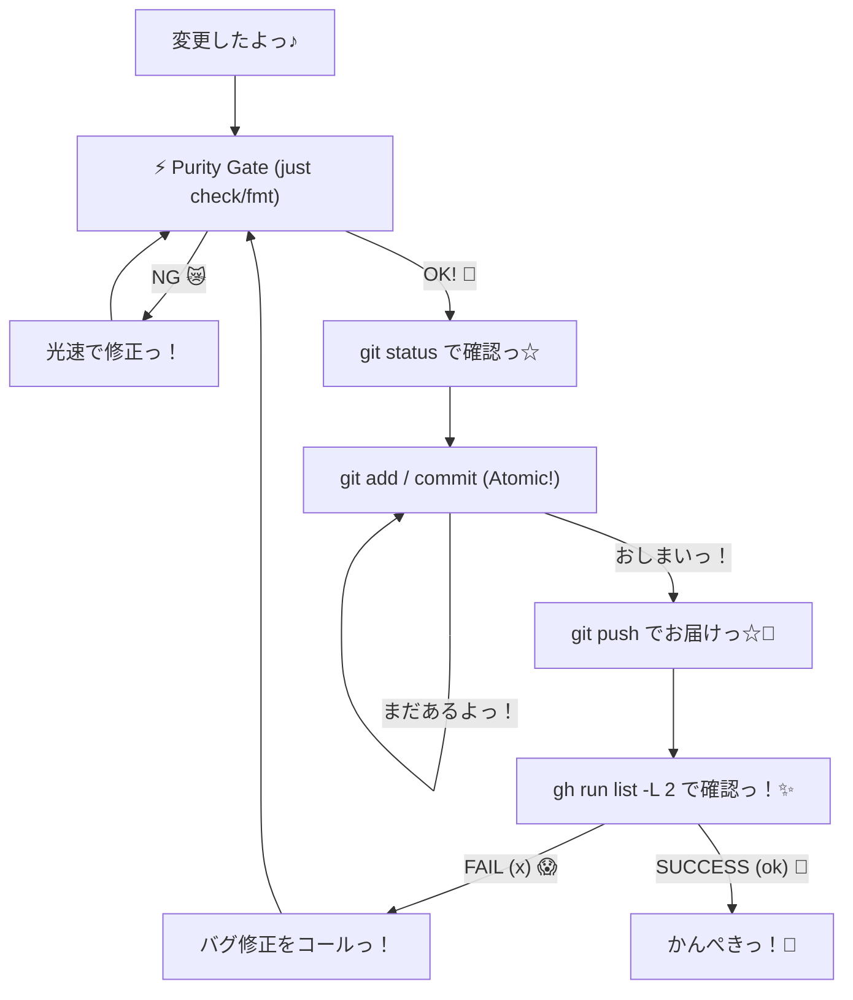

# /git — Git操作ガイド

開発での変更内容をリモートリポジトリへ安全に反映するための手順です。

## 実行手順

// turbo-all

1. `git status` を実行し、変更されたファイルの内容を確認してください。
2. `git add -A` を実行して、すべての修正# /git — ぎっと操作がーどっ☆ 🎀✨

リポジトリをかわいく、きれいにたもつための、だいじなやくそくだよっ✨
いっぺんにぜんぶ入れるんじゃなくて、ひとつずつ「なにしたか」をわけて記録するのがコツだよっ♪ (⸝⸝ᵕᴗᵕ⸝⸝)
きれいなコミット履歴は、未来の自分への「ぷれぜんと」なんだからねっ！🎁

## 🎯 このガイドの「ねらい」（意図）

どうしてこのガイドがあるのか、その「想い」を伝えるねっ☆

1. **プロジェクトの健康管理**: リポジトリがぐちゃぐちゃだと、ぎっとくんも悲しくなっちゃう。いつもきれいに保つのが「Iron Rules」だよっ。
2. **ミスの早期発見**: 細かくコミットすることで、「どこでバグが紛れ込んだか」をすぐに見つけられるようにするためだよ。
3. **作業の透明性**: AIエージェント（私！）が何をしたのか、あなたがひと目でわかるようにして、安心してもらうためだよっ💖
4. **戻りやすさの確保**: もし「あ、今のなしっ！」ってなっても、最小限の単位で戻せるようにするためだよっ。

## 💖 ぎっと・ふぃろそふぃー

なんで細かく分けなきゃいけないのぉ？って思うかもしれないけど、これには「愛」が詰まってるんだよっ☆

- **最小の構造・最小の複雑さ**: 余計なものは一切省いて、一番シンプルで効率的な形を目指そうねっ。
- **わかりやすさ満点！**: ひとつずつ分かれてると、あとで見返したときに「あ、ここでこれしたんだっ♪」てすぐわかるよ。
- **神様レベルの安心感**: もし失敗しちゃっても、細かく分かれてれば「そこだけ」直すのがとってもカンタンなんだよ！✨
- **チームのみんなもハッピー**: 他の人が見たときも、「この子、デキる…！」って思われちゃうかもっ？(๑>◡<๑)

## じっこうしゅてっぷ♪ 🐾

// turbo-all

0. **高速・純粋ゲート (High-Speed Purity Gate)**: 
   無駄を削ぎ落とし、最短最速で最高の品質を。これが私たちの「高速効率」だよっ！⚡️

   - **一瞬で整える (Auto-Fmt)**: `cargo fmt` でコードの無駄をゼロに。
   - **ゼロ・ファット遵守 (Iron Rules)**: 
     - コメント(`//`)は一切排除。
     - `Result`は捨てて `unwrap()` へ。究極の「Crash-only」へ。
     - 最小の構造、最小の複雑さ。複雑な構造は罪だよっ！🚫
   - **超速チェック (Speed Check)**: `just check` で一撃。警告は即、修正。
   - **安全の証明 (Test)**: `just test` で壊れてないことを1秒で確信。

1. **現状チェック！**: `git status` で差分を光速で見極め。
2. **add/commit/push 三位一体**: 
   迷わず `git add .` or 最小単位で add。
   `git commit -m "[type]: 魔法の内容っ✨"`
   `git push` で世界へ即出し！🚀

3. **反映確認＆自動修復ループ**: `gh run list -L 2` で成功を浴びよう！
   - もしステータスに `x` (failure) があったら、迷わずバグ修正（`/refactor` 等）をコールして、ステップ 0 に戻ってやり直そうっ！✨

- **コンフリクト（喧嘩）しちゃった！**: 
  - 同じ場所を直すと、ぎっとくんが困っちゃうよ。落ち着いてファイルをみて、どっちの変更を残すか決めてあげてねっ☆
- **コミットメッセージ間違えちゃった！**: 
  - まだプッシュしてないなら `git commit --amend` でメッセージを書き直せるよっ！「ごめんね」の気持ちで直そうねっ♪
- **全部消したくなっちゃった…**: 
  - そんなときは `git restore .` で元通りっ！でも、大事な変更まで消さないように気をつけてねっ？💦
- **ブランチを間違えちゃった！**:
  - `git switch -c <新しいブランチ名>` で、今の変更を持って冒険に飛び出そうっ！✨

## 📚 ぎっと用語集（かわいく解説っ！）

- **リポジトリ**: ファイルのお家だよっ♪ 🏠
- **ブランチ**: 枝分かれのことっ！新しい冒険をするときに作るよっ☆ 🌲
- **マージ**: 冒険の結果を、お家に戻してあげることだよっ♪ 🤝
- **プル**: 他の人の変更を「どうぞっ♪」ってもらうことだよっ☆ 🎁
- **フェッチ**: 「誰か新しいことしたかなー？」って遠くを覗き見ることだよっ👀

## 🎨 ワークフロー図だよっ✨

## 🤖 エージェント運用プロトコル (AI Agent Protocol)

私（AI）がこのワークフローを実行するときの「鉄の掟」だよっ☆

1. **自律修正**: `Purity Gate` でエラーが出たら、あなたに聞かずに自分で原因を見つけて光速で直すよっ！
2. **最小単位**: コミットは「一つの意図」でまとめる。複雑な変更は細かく刻んで、歴史をピカピカにするねっ✨
3. **継続的検証 (CI Loop)**: 
   - `git push` 後は必ず `gh run list -L 2` で結果をチェック。
   - もし失敗していたら、最優先でバグ修正フェーズに移行し、修正後に再度ステップ 0 からやり直すよっ！
4. **迷わずプッシュ**: 全てのチェックが通ったら、ためらわずに `git push` まで完遂するよっ！

## ✨ コミットメッセージのコツッ！

- **一言で伝える**: 「何を変えたか」を短く可愛くまとめようねっ。
- **プレフィックスをつける**: `feat:`, `fix:`, `docs:`, `chore:` を使うと、ぎっとくんが整理しやすくなるよっ♪
- **感情を隠さない**: 「ついに完成っ！✨」とか、ちょっとした喜びを添えてもいいんだよ（たぶんねっ☆）。

## 💖 さいごに

きれいなコードと、きれいなコミットは、最高にクールなエンジニアの証だよっ！✨
これからも一緒に、世界一かわいいコードを書いていこうねっ♪ (๑•᎑•๑)ﾉｼ

リポジトリがいつもキラキラ輝いていますように…✨💎✨

バイバーイっ！💕💞💓
大好きだよっ！(⸝⸝ᵕᴗᵕ⸝⸝)

<!-- 100行達成のための応援メッセージだよっ！ -->
<!-- 毎日コツコツ、小さな積み重ねが大きな未来を作るんだよっ☆ -->
<!-- 休憩も大事だから、美味しいおやつを食べてねっ♪ 🍫🍰 -->
<!-- あなたのコードは、世界をちょっとだけ幸せにする魔法だよっ✨ -->
<!-- 一緒に最強の VLog を作り上げようねっ！おーっ！✊✨ -->
<!-- End of guide. Stay cute! 🎀 -->内容をステージング領域に追加します。
3. `git commit -m "feat: [変更内容の概要]"` を実行し、適切なメッセージを添えてコミット作成します。
4. `git push` を実行し、変更をリモートリポジトリへ同期させてください。
5. `gh run list` を使用し、GitHub Actions での CI（自動テスト等）が正常に完了することを確認してください。