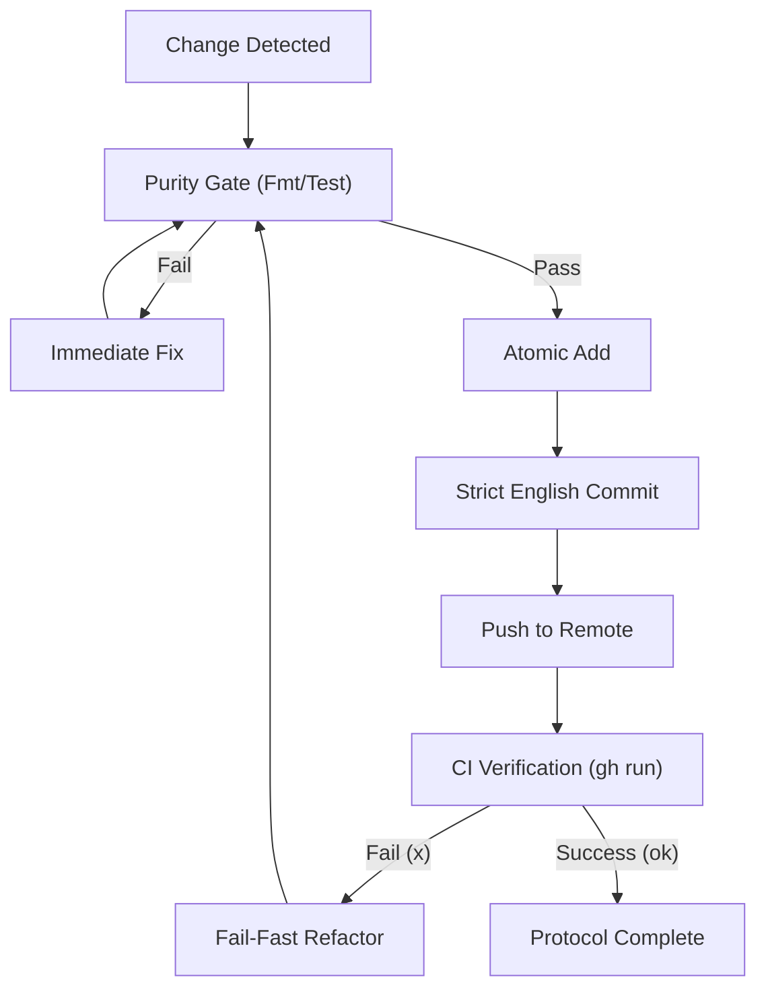

# /git — High-Frequency Git Operations Guide

Strict adherence to this protocol ensures repository integrity, auditability, and seamless CI/CD execution.

## 1. Objectives
1. **Repository Health**: Maintain a clean, linear history through atomic commits.
2. **Deterministic Messaging**: Use strict English prefixes for machine-parsable history.
3. **Fail-Fast Integration**: Immediate pushes to the remote repository for rapid CI feedback.

## 2. Protocols

### Atomic Commits
- Each commit must represent a single, isolated intent.
- Do not combine unrelated refactors with feature development.

### Messaging Standards
- **Language**: Strict, technical English ONLY.
- **Prefixes**:
  - `feat`: New capabilities
  - `fix`: Bug resolution
  - `refactor`: Structural improvement (no logic change)
  - `docs`: Documentation updates
  - `chore`: Maintenance/Dependency updates

## 3. Execution Procedure

// turbo-all

### Step 0: Purity Gate (Validation)
Before staging, ensure local integrity:
- `npm run fmt` (Fmt/Lint check)
- `task test` (Logic verification)

### Step 1: Atomic Staging
```bash
git add <file_path_1> <file_path_2>
```

### Step 2: Protocol-Compliant Commitment
```bash
git commit -m "[type]: [concise strict English description]"
```

### Step 3: Immediate Synchronization
```bash
git push
```

### Step 4: CI Loop Verification
```bash
gh run list -L 2
```
If status indicates failure (`x`), immediately trigger a `/refactor` or `/improve` flow to resolve the regression.

## 4. Visual Workflow


```mermaid
graph TD
    A["Change Detected"] --> P["Purity Gate (Fmt/Test)"]
    P -- "Fail" --> F["Immediate Fix"]
    F --> P
    P -- "Pass" --> B["Atomic Add"]
    B --> C["Strict English Commit"]
    C --> E["Push to Remote"]
    E --> G["CI Verification (gh run)"]
    G -- "Fail (x)" --> R["Fail-Fast Refactor"]
    R --> P
    G -- "Success (ok)" --> Finish["Protocol Complete"]
```

## 5. Agent Protocol (Iron Rules)
1. **Autonomous Recovery**: If the Purity Gate fails, identify and fix the root cause without user intervention.
2. **Sequential Atomicity**: Stage and commit files based on their functional grouping.
3. **No Compromise**: Never bypass the Purity Gate for "convenience."