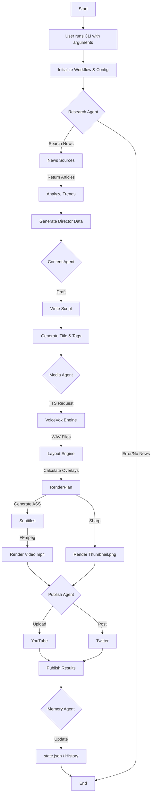

# System Activity Diagram

```mermaid
flowchart TD
    Start[Start] --> UserInput[User runs CLI with arguments]
    UserInput --> Init[Initialize Workflow & Config]
    Init --> Research{Research Agent}
    
    Research -->|Search News| Web[News Sources]
    Web -->|Return Articles| Analyze[Analyze Trends]
    Analyze --> Director[Generate Director Data]
    
    Director --> Content{Content Agent}
    Content -->|Draft| Script[Write Script]
    Script --> Metadata[Generate Title & Tags]
    
    Metadata --> Media{Media Agent}
    Media -->|TTS Request| VoiceVox[VoiceVox Engine]
    VoiceVox -->|WAV Files| Layout[Layout Engine]
    
    Layout -->|Calculate Overlays| RenderPlan
    RenderPlan -->|Generate ASS| Subtitles
    Subtitles -->|FFmpeg| Video[Render Video.mp4]
    RenderPlan -->|Sharp| Thumb[Render Thumbnail.png]
    
    Video --> Publish{Publish Agent}
    Thumb --> Publish
    
    Publish -->|Upload| YouTube[YouTube]
    Publish -->|Post| Twitter[Twitter]
    
    YouTube --> Result[Publish Results]
    Twitter --> Result
    
    Result --> Memory{Memory Agent}
    Memory -->|Update| History[state.json / History]
    
    History --> EndNode[End]
    
    Research -- "Error/No News" --> EndNode
```
