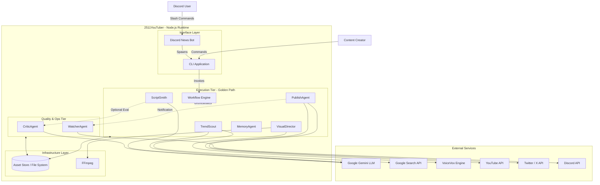
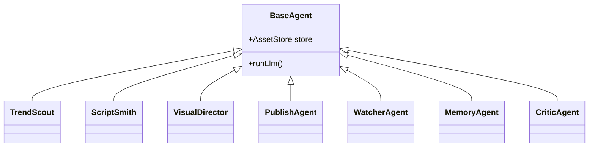

# System Architecture

## Tiered View

```mermaid
flowchart TB
    User[Content Creator]
    DiscordUser[Discord User]
    
    subgraph External [External Services]
        Gemini[Google Gemini LLM]
        Search[Google Search API]
        VoiceVox[VoiceVox Engine]
        YouTube[YouTube API]
        Twitter[Twitter / X API]
        DiscordAPI[Discord API]
    end

    subgraph System [2511YouTuber - Node.js Runtime]
        
        subgraph Entry [Interface Layer]
            CLI[CLI Application]
            Bot[Discord News Bot]
        end

        subgraph Core [Execution Tier - Golden Path]
            Graph[Workflow Engine]
            TS[TrendScout]
            SS[ScriptSmith]
            VD[VisualDirector]
            PA[PublishAgent]
            MA[MemoryAgent]
        end

        subgraph Support [Quality & Ops Tier]
            CA[CriticAgent]
            WA[WatcherAgent]
        end

        subgraph Infra [Infrastructure Layer]
            Store[(Asset Store / File System)]
            FF[FFmpeg]
        end
    end

    User -->|Commands| CLI
    DiscordUser -->|Slash Commands| Bot
    Bot -->|Spawns| CLI
    CLI -->|Invokes| Graph
    
    Graph -->|Orchestrates| Core
    SS -.->|Optional Eval| CA
    PA -.->|Notification| WA
    
    TS --> Gemini & Search
    SS --> Gemini
    CA --> Gemini
    VD --> VoiceVox & FF
    PA --> YouTube & Twitter
    WA --> DiscordAPI
    
    Core & Support <--> Store
```

## Agent Hierarchy

```mermaid
classDiagram
    class BaseAgent {
        +AssetStore store
        +runLlm()
    }
    
    subgraph Discovery
        TrendScout
    end
    
    subgraph Generation
        ScriptSmith
        CriticAgent
    end
    
    subgraph Media
        VisualDirector
    end
    
    subgraph Delivery
        PublishAgent
        WatcherAgent
        MemoryAgent
    end

    BaseAgent <|-- TrendScout
    BaseAgent <|-- ScriptSmith
    BaseAgent <|-- VisualDirector
    BaseAgent <|-- PublishAgent
    BaseAgent <|-- WatcherAgent
    BaseAgent <|-- MemoryAgent
    BaseAgent <|-- CriticAgent
```
