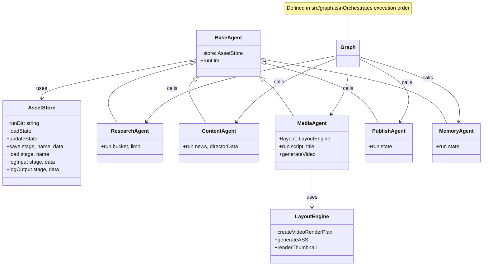

# Component Diagram

```mermaid
classDiagram
    class AssetStore {
        +runDir: string
        +loadState
        +updateState
        +save stage, name, data
        +load stage, name
        +logInput stage, data
        +logOutput stage, data
    }

    class LayoutEngine {
        +createVideoRenderPlan
        +generateASS
        +renderThumbnail
    }

    class BaseAgent {
        +store: AssetStore
        +runLlm
    }

    class ResearchAgent {
        +run bucket, limit
    }

    class ContentAgent {
        +run news, directorData
    }

    class MediaAgent {
        +layout: LayoutEngine
        +run script, title
        +generateVideo
    }

    class PublishAgent {
        +run state
    }

    class MemoryAgent {
        +run state
    }

    BaseAgent <|-- ResearchAgent
    BaseAgent <|-- ContentAgent
    BaseAgent <|-- MediaAgent
    BaseAgent <|-- PublishAgent
    BaseAgent <|-- MemoryAgent

    BaseAgent --> AssetStore : uses
    MediaAgent --> LayoutEngine : uses
    Graph --> ResearchAgent : calls
    Graph --> ContentAgent : calls
    Graph --> MediaAgent : calls
    Graph --> PublishAgent : calls
    Graph --> MemoryAgent : calls

    note for Graph "Defined in src/graph.ts\nOrchestrates execution order"
```
