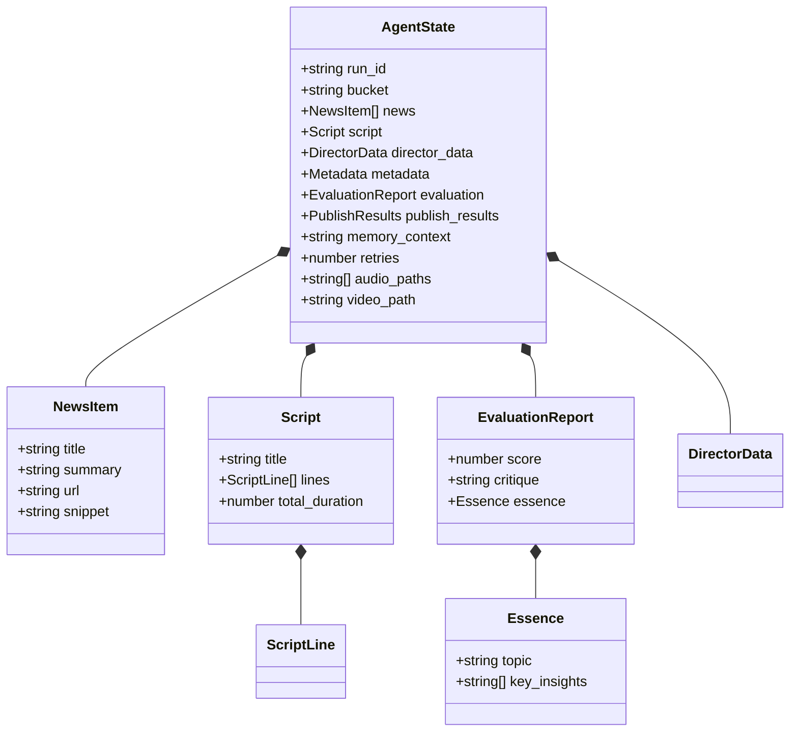

# Domain Model

```mermaid
classDiagram
    class AgentState {
        +string run_id
        +string bucket
        +NewsItem[] news
        +Script script
        +DirectorData director_data
        +Metadata metadata
        +EvaluationReport evaluation
        +PublishResults publish_results
        +string memory_context
        +number retries
        +string[] audio_paths
        +string video_path
    }

    class NewsItem {
        +string title
        +string summary
        +string url
        +string snippet
    }

    class Script {
        +string title
        +ScriptLine[] lines
        +number total_duration
    }

    class EvaluationReport {
        +number score
        +string critique
        +Essence essence
    }

    class Essence {
        +string topic
        +string[] key_insights
    }

    AgentState *-- NewsItem
    AgentState *-- Script
    AgentState *-- EvaluationReport
    AgentState *-- DirectorData
    Script *-- ScriptLine
    EvaluationReport *-- Essence
```
