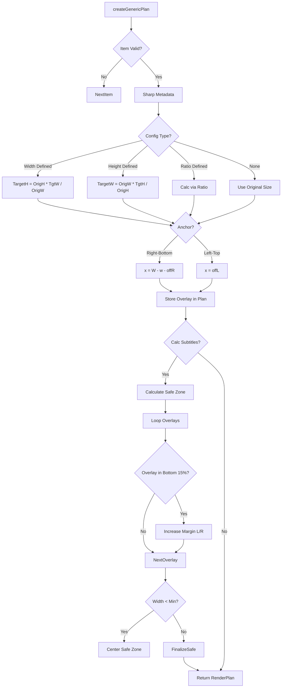

# Layout Engine Logic Diagram

```mermaid
flowchart TD
    Start["createGenericPlan"] --> InputCheck{"Item Valid?"}
    InputCheck -- No --> NextItem
    InputCheck -- Yes --> LoadMeta["Sharp Metadata"]
    
    LoadMeta --> CheckConfig{"Config Type?"}
    CheckConfig -- "Width Defined" --> CalcH["TargetH = OrigH * TgtW / OrigW"]
    CheckConfig -- "Height Defined" --> CalcW["TargetW = OrigW * TgtH / OrigH"]
    CheckConfig -- "Ratio Defined" --> CalcRatio["Calc via Ratio"]
    CheckConfig -- None --> UseOrig["Use Original Size"]
    
    CalcH --> Anchor{"Anchor?"}
    CalcW --> Anchor
    CalcRatio --> Anchor
    UseOrig --> Anchor
    
    Anchor -- "Right-Bottom" --> CalcPosRB["x = W - w - offR"]
    Anchor -- "Left-Top" --> CalcPosLT["x = offL"]
    
    CalcPosRB --> Store["Store Overlay in Plan"]
    CalcPosLT --> Store
    
    Store --> Subtitles{"Calc Subtitles?"}
    Subtitles -- Yes --> SafeZone["Calculate Safe Zone"]
    SafeZone --> LoopOverlays["Loop Overlays"]
    LoopOverlays --> CheckCollision{"Overlay in Bottom 15%?"}
    CheckCollision -- Yes --> AdjustMargin["Increase Margin L/R"]
    CheckCollision -- No --> NextOverlay
    
    AdjustMargin --> NextOverlay
    NextOverlay --> CheckMinWidth{"Width < Min?"}
    CheckMinWidth -- Yes --> Center["Center Safe Zone"]
    CheckMinWidth -- No --> FinalizeSafe
    
    FinalizeSafe --> Return["Return RenderPlan"]
    Subtitles -- No --> Return
```
