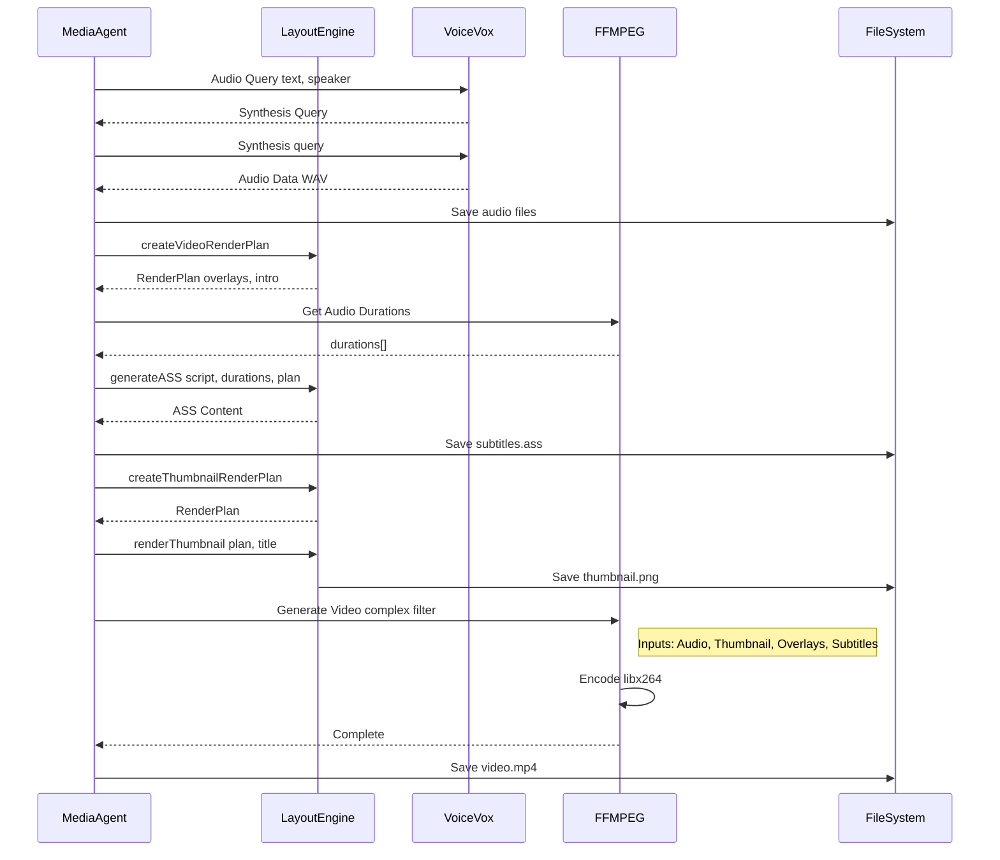

# Media Agent Sequence Diagram

```mermaid
sequenceDiagram
    participant MA as MediaAgent
    participant LE as LayoutEngine
    participant VV as VoiceVox
    participant FF as FFMPEG
    participant FS as FileSystem

    MA->>VV: Audio Query text, speaker
    VV-->>MA: Synthesis Query
    MA->>VV: Synthesis query
    VV-->>MA: Audio Data WAV
    MA->>FS: Save audio files

    MA->>LE: createVideoRenderPlan
    LE-->>MA: RenderPlan overlays, intro

    MA->>FF: Get Audio Durations
    FF-->>MA: durations[]

    MA->>LE: generateASS script, durations, plan
    LE-->>MA: ASS Content
    MA->>FS: Save subtitles.ass

    MA->>LE: createThumbnailRenderPlan
    LE-->>MA: RenderPlan
    MA->>LE: renderThumbnail plan, title
    LE->>FS: Save thumbnail.png

    MA->>FF: Generate Video complex filter
    note right of FF: Inputs: Audio, Thumbnail, Overlays, Subtitles
    FF->>FF: Encode libx264
    FF-->>MA: Complete
    MA->>FS: Save video.mp4
```
