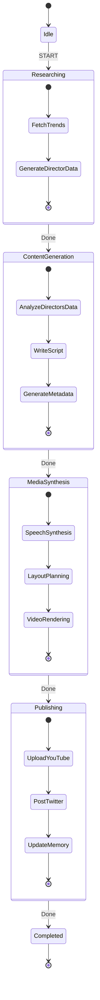

# State Machine Diagram

```mermaid
stateDiagram-v2
    [*] --> Idle
    Idle --> Researching: START
    
    state Researching {
        [*] --> FetchTrends
        FetchTrends --> GenerateDirectorData
        GenerateDirectorData --> [*]
    }

    Researching --> ContentGeneration: Done

    state ContentGeneration {
        [*] --> AnalyzeDirectorsData
        AnalyzeDirectorsData --> WriteScript
        WriteScript --> GenerateMetadata
        GenerateMetadata --> [*]
    }

    ContentGeneration --> MediaSynthesis: Done

    state MediaSynthesis {
        [*] --> SpeechSynthesis
        SpeechSynthesis --> LayoutPlanning
        LayoutPlanning --> VideoRendering
        VideoRendering --> [*]
    }

    MediaSynthesis --> Publishing: Done

    state Publishing {
        [*] --> UploadYouTube
        UploadYouTube --> PostTwitter
        PostTwitter --> UpdateMemory
        UpdateMemory --> [*]
    }

    Publishing --> Completed: Done
    Completed --> [*]
```
