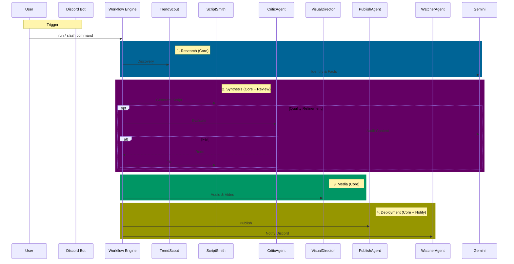
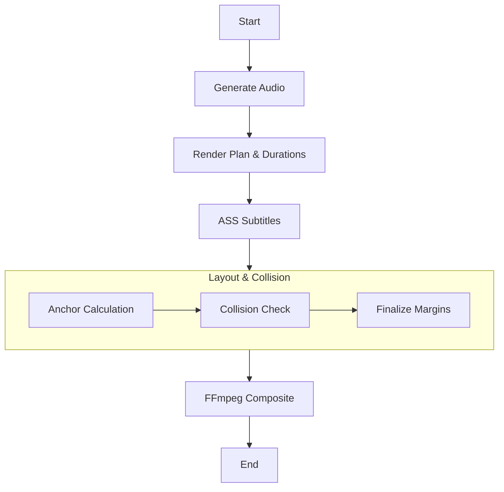

# System Workflow

## Adaptive Pipeline

```mermaid
sequenceDiagram
    participant User
    participant Bot as Discord Bot
    participant Graph as Workflow Engine
    participant TS as TrendScout
    participant SS as ScriptSmith
    participant CA as CriticAgent
    participant VD as VisualDirector
    participant PA as PublishAgent
    participant WA as WatcherAgent
    participant LLM as Gemini

    Note over User, Bot: Trigger
    User->>Graph: run / slash command
    
    rect rgb(0, 100, 150)
        Note right of TS: 1. Research (Core)
        Graph->>TS: Discovery
        TS->>LLM: Identify & Facts
    end

    rect rgb(100, 0, 100)
        Note right of SS: 2. Synthesis (Core + Review)
        Graph->>SS: Generate Script
        
        opt Quality Refinement
            Graph->>CA: Evaluate
            CA->>LLM: Audit Content
            alt Fail
                CA-->>Graph: Redo
                Graph->>SS: Fix
            end
        end
    end

    rect rgb(0, 150, 100)
        Note right of VD: 3. Media (Core)
        Graph->>VD: Audio & Video
    end

    rect rgb(150, 150, 0)
        Note right of PA: 4. Deployment (Core + Notify)
        Graph->>PA: Publish
        Graph->>WA: Notify Discord
    end
```

## Internal Engine Details

### Media Synthesis (VisualDirector)

```mermaid
flowchart TD
    Start --> Audio[Generate Audio]
    Audio --> Plan[Render Plan & Durations]
    Plan --> Sub[ASS Subtitles]
    
    subgraph Engine [Layout & Collision]
        Calc[Anchor Calculation] --> Check[Collision Check]
        Check --> Final[Finalize Margins]
    end
    
    Sub --> Engine
    Engine --> Composite[FFmpeg Composite]
    Composite --> End
```
